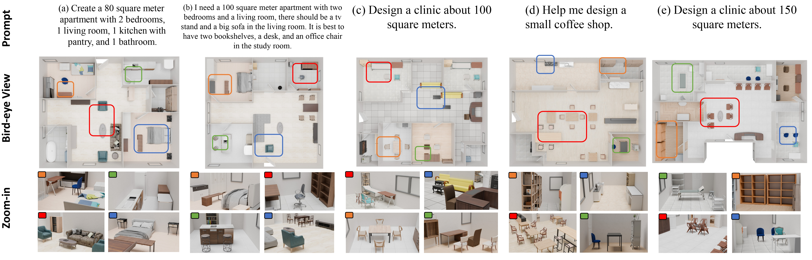

<div align="center">



**TL;DR**: We present a novel framework for automated interior design that combines large language models (LLMs) with grid-based integer programming to jointly optimize room layout and furniture placement.

---

## 📌 TODO

- [X] **Blender 3D Visualization**: A streamlined Blender 3D visualization is now included (see [Usage step 4](#4-run-3d-visualization)), using real furniture assets from the [Imaginarium](https://huggingface.co/datasets/HiHiAllen/Imaginarium-Dataset) asset library. It procedurally builds walls, doors, and windows in addition to furniture and a floor; asset retrieval is a semantic/size heuristic rather than a ground-truth match.
- [ ] **Optimization Acceleration**: Performance improvements and acceleration techniques for the grid-based integer programming.

## 📂 Project Structure

```text
co-layout/
├── agent_os/              # Agent framework (workflow engine & LLM API)
├── agents/                # Agent definitions
├── asset_library/         # (User-downloaded) Imaginarium 3D assets live here by default, or point elsewhere via ASSET_LIBRARY_ROOT
├── test/                  # test scripts
├── optimization/          # Optimization models
├── utils/                 # Utility functions: blender_visualization.py (3D visualization pipeline) + Imaginarium asset download/retrieval
├── output/                # Output data, grouped per run under output/sessions/<session_id>/
├── key/                   # API key config
├── run_agents.py          # Run LLM agents pipeline
├── run_optimization.py    # Run optimization pipeline
├── run_e2e.py             # Run end-to-end pipeline (Agents + Optimization)
└── constants.py           # Project constants
```

## ⚙️ Install

### Conda Environment

```bash
conda create -n co-layout python=3.12
conda activate co-layout
```

### Python Dependencies

Top-level dependency versions are pinned in [`requirements.txt`](requirements.txt) for reproducibility (transitive dependencies are left for `pip`/`uv` to resolve). We recommend installing with [uv](https://docs.astral.sh/uv/) — a drop-in, much faster replacement for `pip` that still installs into your active conda environment (no separate venv, no change to the workflow above):

```bash
pip install uv                      # install uv itself
uv pip install -r requirements.txt
```

Plain `pip install -r requirements.txt` works the same way if you'd rather not use `uv`.

### Gurobi

We use [Gurobi](https://www.gurobi.com/downloads/gurobi-software/) for optimization.
*Note: Version 13.0 is faster than 12.0 according to [Gurobi&#39;s report](https://www.gurobi.com/whats-new-gurobi-13-0/), especially on our MIQCP problem. (Our experiments exported in the paper were conducted with version 12.0).*

An [Academic license](https://support.gurobi.com/hc/en-us/articles/12684663118993-How-do-I-obtain-a-Gurobi-license) is available for researchers.

### API Key Configuration

Copy the example key file and fill in your API keys:

```bash
cp key/llm_key_example.json key/llm_key.json
```

Edit `key/llm_key.json` with your actual API keys.

### API Test

```bash
python test/test_api.py
```

## 🚀 Usage

We provide scripts to run different stages of our pipeline:

### 1. Run LLM Agents Pipeline

To generate structured design constraints from a textual prompt using the LLM workflow:

```bash
python run_agents.py
```

Optional arguments:

| Argument    | Short  | Default                                            | Description           |
| ----------- | ------ | -------------------------------------------------- | --------------------- |
| `--input` | `-i` | `"Design an apartment about 100 square meters."` | Textual design prompt |
| `--model` | `-m` | `gemini-3-pro-preview`                           | AI model name to use  |

Example:

```bash
python run_agents.py --input "xxx" --model gemini-3-flash-preview
```

### 2. Run Optimization Pipeline

To run the grid-based integer programming optimization using the generated constraints:

```bash
python run_optimization.py --session <session_id>
```

Required arguments:

| Argument      | Short  | Description                                 |
| ------------- | ------ | ------------------------------------------- |
| `--session` | `-s` | Session ID generated by the agents pipeline |

Example:

```bash
python run_optimization.py --session 2026-02-06_18-03-50_yHPGOu
```

While it runs, Gurobi prints a MIP progress log (`Incumbent` / `BestBd` / `Gap` columns). `Incumbent` is the best feasible objective found so far, `BestBd` is the theoretical lower bound, and `Gap = (Incumbent - BestBd) / Incumbent` is how far the current solution is from provably optimal — solving stops once `Gap` drops below `MIPGap` (1%, set in [`optimization/coopt_model.py`](optimization/coopt_model.py)/[`floorplan_model.py`](optimization/floorplan_model.py)) or `TimeLimit` (600s/300s) is hit, whichever comes first. `Gap` is the single most useful number to watch: if it's still large when `TimeLimit` cuts the run off, the returned layout is a usable-but-unconverged solution rather than a near-optimal one.

### 3. Run End-to-End Pipeline

To run the complete pipeline from textual prompt to optimized layout in one go:

```bash
python run_e2e.py
```

Optional arguments:

| Argument    | Short  | Default                                            | Description           |
| ----------- | ------ | -------------------------------------------------- | --------------------- |
| `--input` | `-i` | `"Design an apartment about 100 square meters."` | Textual design prompt |
| `--model` | `-m` | `gemini-3-pro-preview`                           | AI model name to use  |

Example:

```bash
python run_e2e.py --input "Design an apartment about 100 square meters." --model gemini-3-flash-preview
```

### 4. Run 3D Visualization

We provide a Blender 3D visualization using real furniture assets from [Imaginarium](https://huggingface.co/datasets/HiHiAllen/Imaginarium-Dataset). It turns the 2D grid optimization result into a metric 3D scene — matching each furniture item to a retrieved asset, deriving walls/doors/windows from the grid, and rendering it all in Blender with auto-framed lighting/camera.

Everything lives in one script, [utils/blender_visualization.py](utils/blender_visualization.py): run as plain Python it exports the layout JSON (needs `sentence-transformers`); re-invoked by Blender (`blender -b -P utils/blender_visualization.py -- ...`) it builds and renders the scene (needs `bpy`). `--auto-render` chains both steps for you.

One-time setup:

```bash
python -m utils.download_imaginarium    # downloads the official Imaginarium dataset from HF (~tens of GB)
python -m utils.asset_retriever         # builds the local semantic asset index
```

You also need [Blender](https://www.blender.org/download/) installed (used as an external renderer, not a pip dependency).

Then, for a session that has already been optimized (see step 2):

```bash
python utils/blender_visualization.py --session session_id --auto-render
```

Optional arguments:

| Argument                                      | Default                                                | Description                                                                                             |
| --------------------------------------------- | ------------------------------------------------------ | ------------------------------------------------------------------------------------------------------- |
| `--result`                                  | `output/sessions/<session>/optimization/result.json` | Path to a specific optimization result JSON                                                             |
| `--render-image`                            | `output/sessions/<session>/visualization/render.png` | Rendered image output path                                                                              |
| `--render-resolution`                       | `1920 1920`                                          | Render resolution                                                                                       |
| `--floor-texture`                           | `assets/floor_texture.jpg`                           | Path to a floor texture image                                                                           |
| `--render-engine`                           | `BLENDER_EEVEE_NEXT`                                 | `BLENDER_EEVEE_NEXT` / `EEVEE` / `CYCLES`                                                         |
| `--camera-azimuth` / `--camera-elevation` | `235` / `55` (degrees)                             | Camera framing; elevation needs to stay fairly high so the camera can see over the walls into the rooms |
| `--show-axes`                               | off                                                    | Draw an RGB world-axis indicator (debugging aid)                                                        |
| `--auto-render`                             | off                                                    | Invoke Blender automatically instead of just printing the command                                       |

Without `--auto-render`, the script only exports the 3D layout JSON and prints the `blender -b -P ...` command for you to run yourself (Blender rendering runs in its own process; see [utils/paths.py](utils/paths.py) for dataset path configuration via `ASSET_LIBRARY_ROOT`).

## 📖 Citation

If you find our work useful in your research, please consider citing:

```bibtex
@article{Xiang2026Co,
  title={Co-Layout: LLM-driven Co-optimization for Interior Layout},
  author={Xiang, Chucheng and Bao, Ruchao and Feng, Biyin and Wu, Wenzheng and Liu, Zhongyuan and Guan, Yirui and Liu, Ligang},
  journal={Proceedings of the AAAI Conference on Artificial Intelligence},
  volume={40},
  number={17},
  pages={14371-14379},
  year={2026},
  month={Mar.},
  doi={10.1609/aaai.v40i17.38452},
  url={https://ojs.aaai.org/index.php/AAAI/article/view/38452}
}
```
